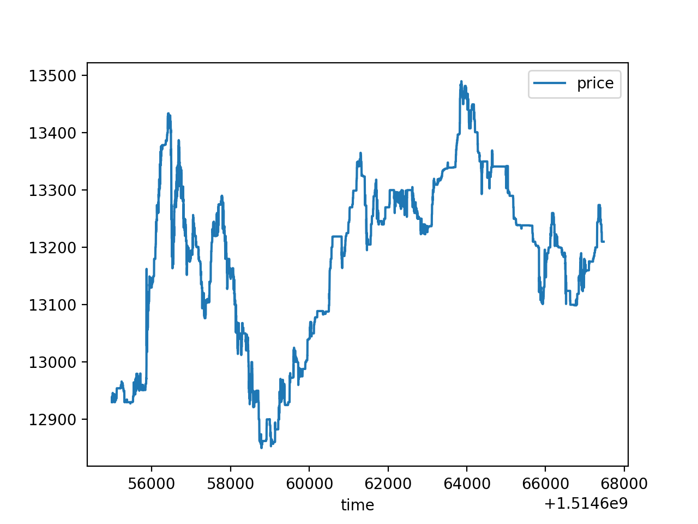

# Stock Price Prediction.

The goal of this project is to predict BTC/USD price using historical trade data,
and to get experience using the `tensorflow.estimator` API.

The raw data has the following features: 

|feature|description|
|-------|-----------|
|size 		| The size of BTC traded  |
|price		| The price in USD per BTC|  
|side		| whether the traded was executed by a buyer or seller |
|time 		| the time at which the trade was executed 

The raw data which is collected from the websocket comes at irregular time
intervals,
and is frequently batched together (so there will be multiple trades with the
same timestamp). In order to resolve this, we resample our data
into one-second intervals, and replace `price` by the average price in that
interval weighted by the size of the trade, and we drop the `side`.  

Next, in order to normalize our inputs, we calculate the feature `change`
from `price`, which is just given by change(t+1) = p(t+1) / p(t).

# Architecture
## Inputs
The inputs to our model are a sequence of observations of length `window`, so
the shape of our input is `batch_size x window_length x m` where `m` is the
number of features. When a sequence of length `S` is used for 
evaluation or prediction, the inputs are put into a single tensor of shape 
`1 x S x m` for compatibilty between training and evaluation/prediction.

## Targets

Our target variable is the percent change in price at some horizon `h` - 
by default we set `h = 10`. So for an input batch of shape `batch_size x
window_length x m` our output has shape `batch_size x window_length`.

## Model description and Training

Our model archiecture is as follows: Our inputs are first fed in to 
a network with three layers of LSTM cells,
whose output is fed into a dense layer to get a prediction. 
In training, we use rolling windows of size one hundred in order to
increase the number of training samples we have and reduce bias. Our training
loss is mean squared error. Tensorflow uses truncated backpropagation through
(TBTT) time to update the weights in the graph. We also add a combination of
`l1` and `l2` regularization.

# Evaluation 

One hurdle in this model is that mean squared error is not a particurly
informative loss, in the sense that if our goal is to trade according to some
strategy using the predictions that our agent makes, 
then it is difficult to interpret the MSE in a meaningful way. 

A more instructive metric is what is referred to in finance as
PnL - profit and loss of a trading strategy. The trading strategy we use to
compute this metric is very simple - if we predict price increasing, then we 
buy one dollar of stock, and if we predict price decreasing, we sell 1 dollar's
worth of stock. 

In more detail: we have two accounts, `U` (for USD),  and `B` (for BTC).
`U` and `B` are initialized to `0`. 
At time `t`, we know the current price `p` and make forecast  `f` for the percent change in 
`horizon` seconds. If `f` is positive, we do `U = U - 1` and `B = B + 1/p` (buy
one dollar of BTC). If `f` is negative, we do `U = U + 1`, and `B = B - 1/p`
(sell a dollar of BTC). If `p_final` is the final price, we can then calculate `pnl =
U + p * final` to calculuate our change in net worth obtained by following the betting
strategy. 

# Configurable parameters
 See `src.models.lstm.DEFAULT_MODEL_PARAMS` and
 `src.models.lstm.DEFAULT_TRAIN_PARAMS` to see the parameters that the model and
 train function accept.

# Datasets

Use `src.utils.collect` to collect data from GDAX and build your own datasets. A
few datasets are included.

Model is located in `src.models.lstm`, an can be trained, evaluated, and used to
predict with methods defined there.
