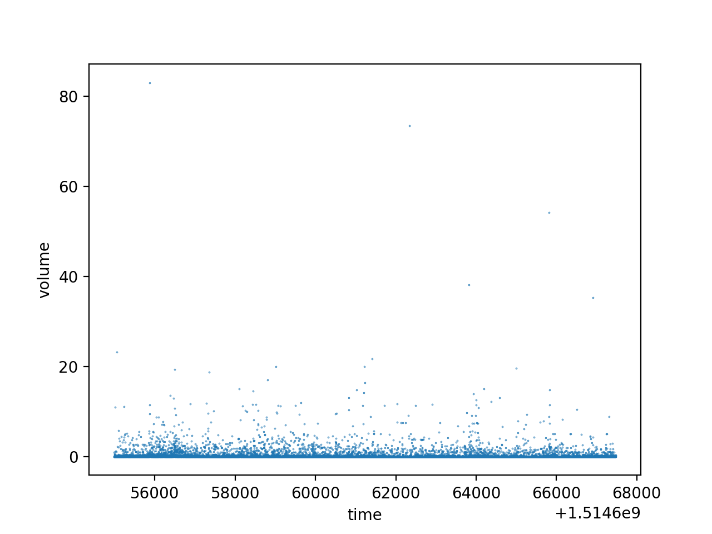
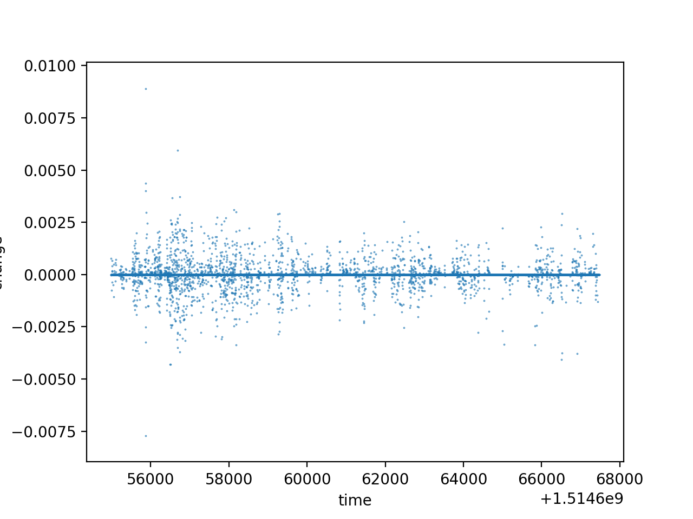

# Stock Price Prediction.

The goal of this project is to predict stock price using historical trade data.

The features of a trade are `size`, `price`, `side`, and `time`.

The raw data which is collected from the websocket comes at irregular timestamps,
and is frequently batched together. In order to solve this, we resample our data
into one-second intervals, and replace `price` by the average price in that
interval weighted by the size of the trade, and we drop the `side`.  

Next, in order to normalize our inputs, we calculate the feature `pct_change`
from `price`, which is just given by change(t+1) = p(t+1) / p(t).

The model architecture is an LSTM RNN, whose output is fed into a dense layer to
get a prediction. In training, we use rolling windows of size one hundred in order to
increase the number of training samples we have and reduce bias. 

This project is still being actively developed, and has not been tested on all
systems. 

# Datasets

Use `src.utils.collect` to collect data from GDAX and build your own datasets. A
few datasets are included.

Model is located in `src.models.lstm`, and can be run from command line with
default arguments with `python -m src.models.lstm'.
